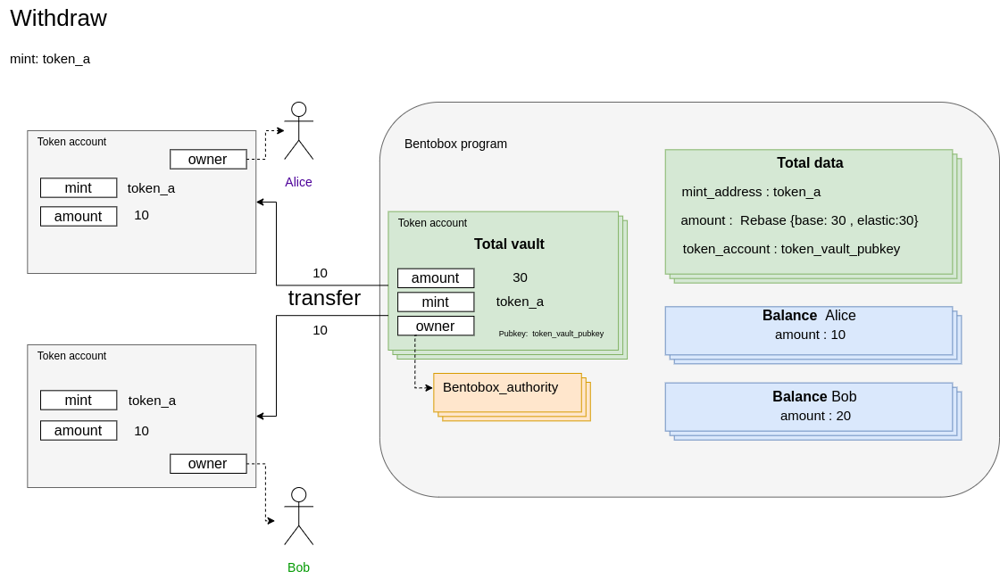

### Withdraw

Everyone wallet can send a transaction with instruction `withdraw` to the bentobox program to withdraw tokens back to token account from Bentobox. If signer is master contract you need to create and provide some extra accounts which describes below.

#### Preparation
1. [Create bentobox](./01-create-bentobox.md)
2. [Create total accounts](./02-create-total-accounts.md)
3. [Create balance](./03-create-balance-account.md)

If signer is master contract (PDA) it **MUST** be whitelisted and user **MUST** approve this master contract.

1. [Bentobox whitelist](./05-bentobox-whitelist.md#Create520master%20contract%20whitelisted%20account)
2. [Approve master contract](./06-approve-master-contract.md#Create%20master%20contract%20approval%20account)

To withdraw tokens on Bentobox we need the following arguments and accounts.

#### Arguments
1. from: Pubkey - which account to pull the tokens.
2. amount: u64 - token amount in native representation to withdraw.
3. share: u64 - token amount represented in shares to withdraw. Takes precedence over `amount`.
   
#### Accounts

| Field  | Description |
| ------------- | ------------- |
| to  | Token account which pull the tokens |
| bentobox_vault  | Bentobox token account |
| balance  | The account of `Balance` which pull tokens |
| total_data  | The account of `TotalData` for provided mint |
| bentobox_account  | Already created account of `BentoboxAccount` |
| authority  | Signer of `withdraw` instruction |
| vault_authority  | Bentobox PDA, vault authority |
| token_program  | The address of `TokenProgram` |

#### Remaining accounts
Only needed if signer is master contract (PDA)

| Field  | Description |
| ------------- | ------------- |
| master_contract_whitelisted  | The account of `MasterContractWhitelist` which is whitelisted for this Bentobox |
| master_contract_approved  | The account of `MasterContractApproved` for this master contract which already approved by user | 
| master_contract_account  | The master contract account |  
