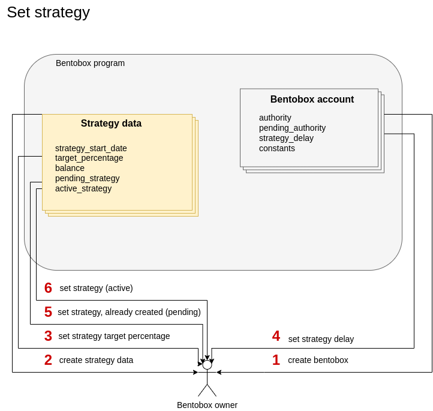

### Set strategy

#### Preparation
1. [Create bentobox](./01-create-bentobox.md)
2. [Create total accounts](./02-create-total-accounts.md)
3. [Create balance](./03-create-balance.md)

#### Create strategy data account

Everyone can send a transaction with instruction `create_strategy_data` to the bentobox program to create `StrategyData` account on Bentobox for a specific token. In this account stores base data for strategy. 

##### Accounts

| Field  | Description |
| ------------- | ------------- |
| strategy_data  |  The account of `StrategyData` |
| authority  | Signer of `create_strategy_data` instruction |
| mint | The token mint account for which the `StrategyData` account is created |
| bentobox_account  | Already created account of `BentoboxAccount` |
| system_program | The address of `SystemProgram` |

#### Create strategy delay
This instruction using for setting strategy delay. **ONLY** Bentobox owner can set strategy delay.  

##### Arguments
1. delay: u64 - delay for strategy.

##### Accounts

| Field  | Description |
| ------------- | ------------- |
| bentobox_account  |  Already created account of `BentoboxAccount` |
| authority  | Signer of `set_strategy_delay` instruction. **ONLY** Bentobox owner |
| system_program | The address of `SystemProgram` |

#### Create strategy target percentage

This instraction sets the target percentage of the strategy for `token`. **ONLY** Bentobox owner can set and change strategy target percentage.

##### Arguments
1. target_percentage: u64 - the new target in percent. Must be lesser or equal to `MAX_TARGET_PERCENTAGE`.

##### Accounts

| Field  | Description |
| ------------- | ------------- |
| strategy_data  |  Already created account of `StrategyData` which stores base data for strategy |
| bentobox_account  |  Already created account of `BentoboxAccount` |
| authority  | Signer of `set_strategy_target_percentage` instruction. **ONLY** Bentobox owner |

#### Set strategy

Sets the contract address of a new strategy that conforms to `strategy_inferface` for `token`. Must be called twice with the same arguments. A new strategy becomes pending first and can be activated once `strategy_delay` is over. A new owner of this contract is allowed to change this.

##### Accounts
| Field  | Description |
| ------------- | ------------- |
| strategy_program  | The address of `strategy` program with inherites `strategy_interface` |
| bentobox_program  | The address of `Bentobox` program |
| bentobox_account  | Already created `BentoboxAccount` |
| strategy_account  | Already created `StrategyAccount` |
| strategy_data  | Already created account of `StrategyData` which stores base data for strategy |
| bentobox_vault  | Bentobox token account |
| strategy_vault  | Strategy token account |
| total_data  | The already created `TotalData` account |
| token_program  | The address of `TokenProgram` |
| base_strategy_info  | The address of `BaseStrategyInfo` account which describes in `strategy_interface` |
| bentobox_authority  | The `bentobox_vault` authority (PDA) |
| authority  | Signer of `set_strategy` instruction. **ONLY** Bentobox owner |
| strategy_authority  | The`strategy_vault` authority (PDA) |
| system_program  | The address of `SystemProgram` |