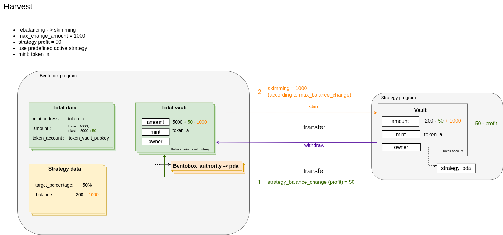

### Harvest

The actual process of yield farming. Executes the strategy of token. Optionally does housekeeping if `balance` is true. `maxChangeAmount` is relevant for skimming or withdrawing if `balance` is true.

#### Preparation
1. [Create bentobox](./01-create-bentobox.md)
2. [Create total accounts](./02-create-total-accounts.md)
3. [Create balance](./03-create-balance.md)
4. [Deposit](./08-deposit.md)
5. [Set strategy](./12-set-strategy.md)

#### Arguments
1. balance: bool - True if housekeeping should be done.
2. max_change_amount: u64 - the maximum amount for either pulling or pushing from/to the `Strategy` contract.
3. bump: u8 - bentobox_authority PDA bump.

#### Accounts
| Field  | Description |
| ------------- | ------------- |
| strategy_program | The address of `strategy` program with inherites `strategy_interface` |
| bentobox_program | The address of `Bentobox` program |
| strategy_account | Already created `StrategyAccount` |
| strategy_vault | Strategy token account |
| bentobox_vault | Bentobox token account |
| total_data | The already created `TotalData` account |
| bentobox_account | Already created `BentoboxAccount` |
| cpi_result_account | Already created `Result` account to store strategy harvest result|
| strategy_data | Already created account of `StrategyData` which stores base data for strategy |
| authority | Signer of `save_harvest` instruction. **ONLY** active strategy executor |
| bentobox_authority | The `bentobox_vault` authority (PDA) |
| strategy_authority | The `strategy_vault` authority (PDA)|
| system_program | The address of `SystemProgram` |
| token_program | The address of `TokenProgram` |
| base_strategy_info | Already created `BaseStrategyInfo` account which describes in `strategy_interface`|

