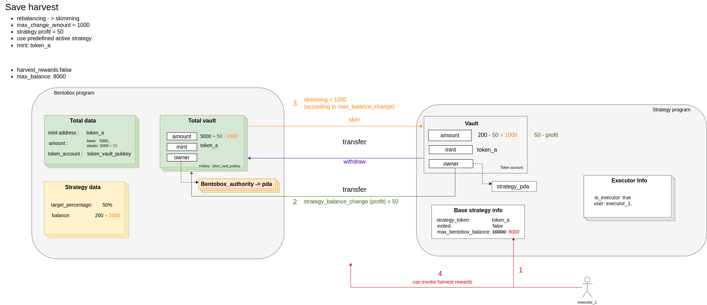

### Save harvest
Harvest profits while preventing a sandwich attack exploit. Can call **ONLY** active strategy executors. See more in `strategy_interface`.

#### Preparation
1. [Create bentobox](./01-create-bentobox.md)
2. [Create total accounts](./02-create-total-accounts.md)
3. [Create balance](./03-create-balance.md)
4. [Deposit](./08-deposit.md)
5. [Set strategy](./12-set-strategy.md)

#### Arguments
1. max_balance - the maximum balance of the underlying token that is allowed to be in `Bentobox`.
2. rebalance - whether `Bentobox` should rebalance the strategy assets to acheive it's target allocation.
3. max_change_amount - when rebalancing - the maximum amount that will be deposited to or withdrawn from a `strategy` to `BentoBox`
4. harvest_rewards - if we want to claim any accrued reward tokens.

#### Accounts
| Field  | Description |
| ------------- | ------------- |
| strategy_program | The address of `strategy` program with inherites `strategy_interface` |
| bentobox_program | The address of `Bentobox` program |
| strategy_account | Already created `StrategyAccount` |
| strategy_vault | Strategy token account |
| bentobox_vault | Bentobox token account |
| total_data | The already created `TotalData` account |
| bentobox_account | Already created `BentoboxAccount` |
| cpi_result_account | Already created `Result` account to store strategy harvest result|
| strategy_data | Already created account of `StrategyData` which stores base data for strategy |
| authority | Signer of `harvest` instruction |
| bentobox_authority | The `bentobox_vault` authority (PDA) |
| strategy_authority | The `strategy_vault` authority (PDA)|
| system_program | The address of `SystemProgram` |
| token_program | The address of `TokenProgram` |
| base_strategy_info | Already created `BaseStrategyInfo` account which describes in `strategy_interface`|
| executor_info | - Already created using strategy program `ExecutorInfo` account.
